<!-- _class: invert -->
# Awesome

Tomoki Tanimura (@tanimu)
d-hacks, Jin Nakazawa Lab, SFC, Keio University, M2

Created At: 2021/06/08

---

<!-- _class: invert -->
# Awesome Researches

- Dataset Distillation
- What’s Hidden in a Randomly Weighted Neural Network?
- ImageNet-Trained CNNs are biased towards texture; increasing shape bias improves accuracy and robustness
- Are Convolutional Neural Networks or Transformers more like human vision?

---

## How awesome are those researches?

- The point that no one address
- Everyone want to know that
- Sharp eyesight

---

# Dataset Distillation

- Model Distillation is to distill the knowledge of the large model to small one
- Dataset Distillation is to distill the knowledge of the large **Dataset** to small one

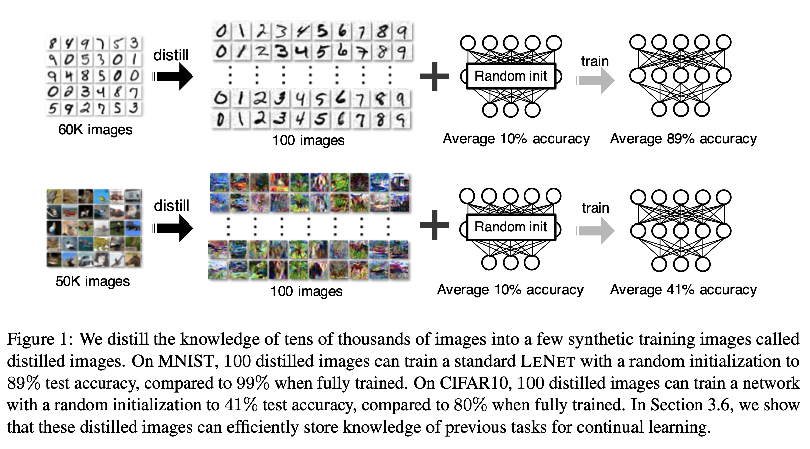

---

## Dataset Distillation / Motivation

- How small can we compress the dataset knowledge?
- Distilled dataset can be used for continuous learning
- Can the model learn by the data sampled from incorrect distribution

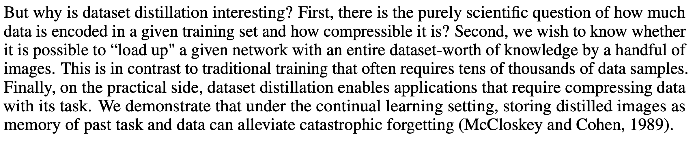

---

## Dataset Distillation / Result

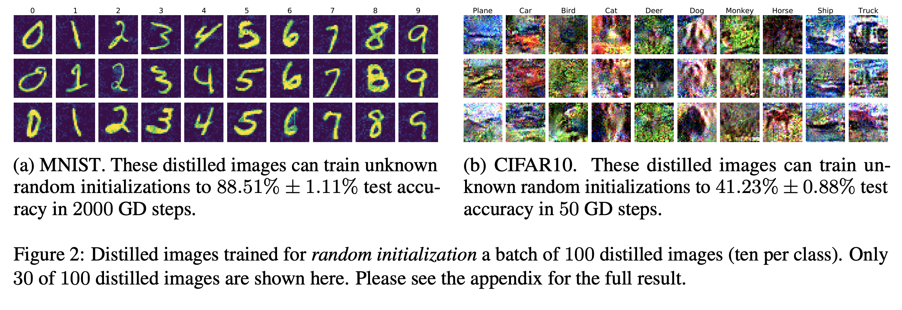

---

# What’s Hidden in a Randomly Weighted Neural Network? (Hidden)

- Q. Does random network contains the subnetwork which can achieve good performance
- Find such subnetwork in large network with random weight
- Propose the efficient method to explore hidden subnetwork

---

## Hidden / Overview

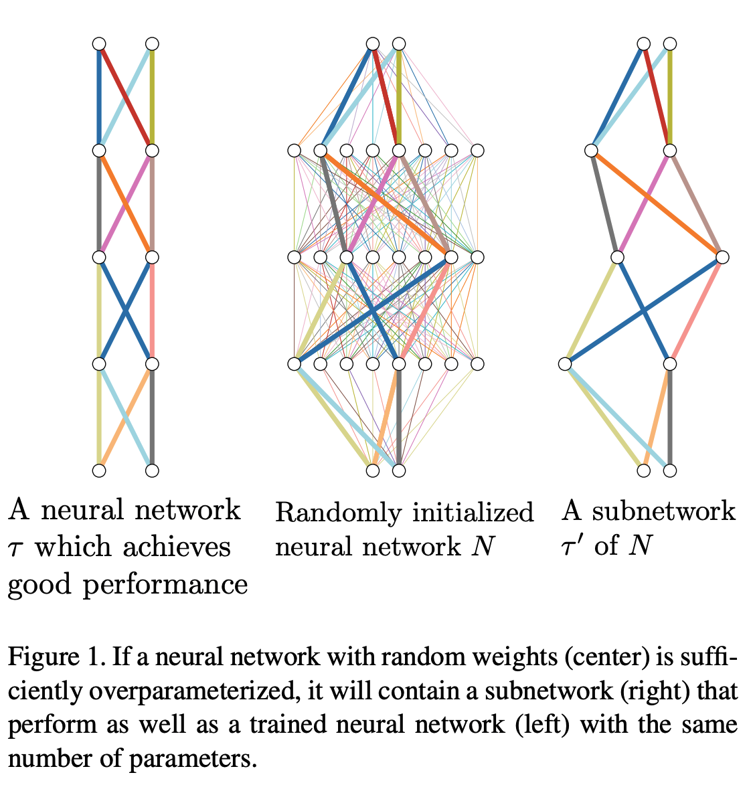

---

## Hidden / Related works

- "The Lottery Ticket Hypothesis"
  - Large random initialized NN has the subnetwork which has the potential to achieve the same performance as the entire network
- Some algorithms are proposed for finding WINiing-ticket effectively
- "WANNs (Weight Agnosstic Neural Network)"
  - Subnetwork of NN has same weight value can achieve almost same accuray as the trained one
  - But, this paper said we cannot  when random initialization 

---

## Hidden / Algorithm

- Set the score to each path
- Select the optimal path based on the score
- Update the scores with GD

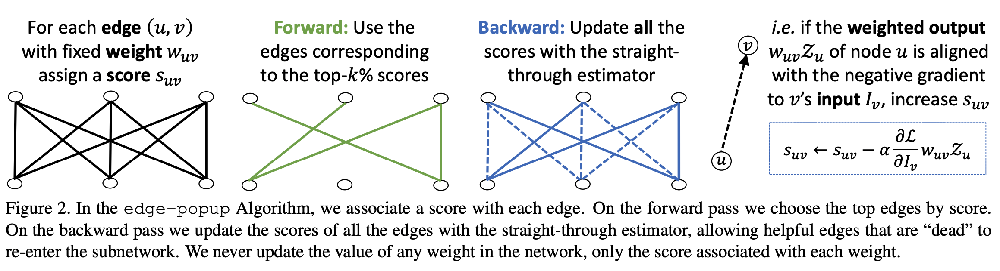

---

## Hidden / Result

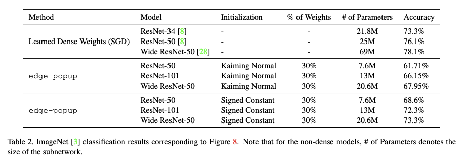

---

# ImageNet-Trained CNNs are biased towards texture; increasing shape bias improves accuracy and robustness

- CNN see texture rather than shape

---

## Texture / Overview

 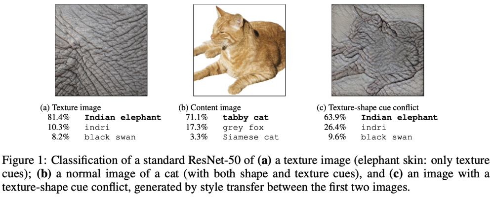
 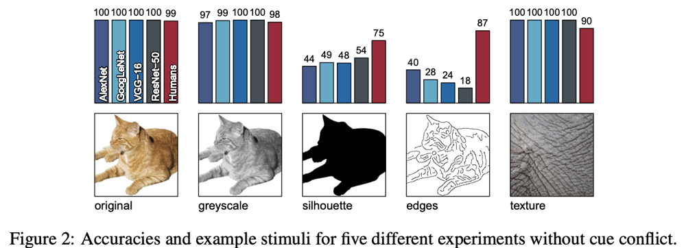

---

## Texture / Compare CNN and Human

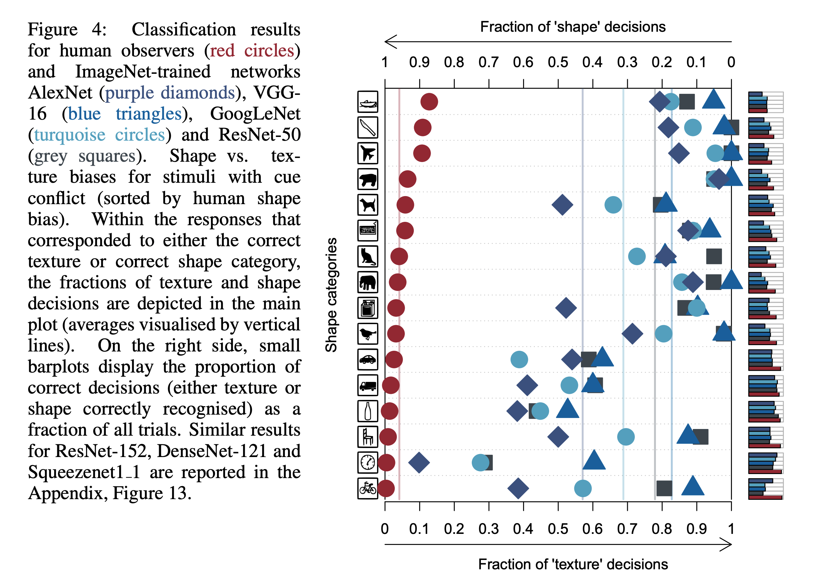

---

## Texture / Stylized dataset

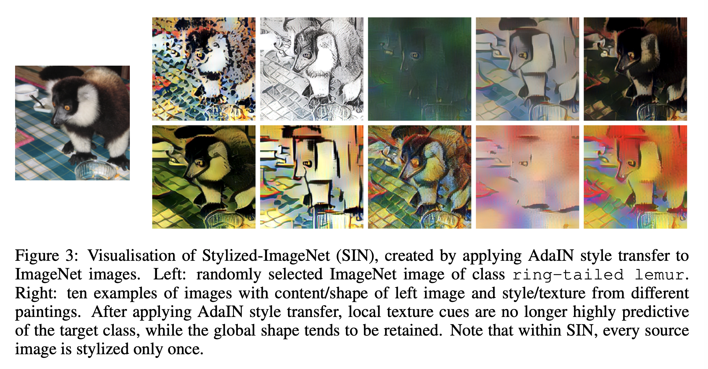

---

## Texture / Performance of SIN

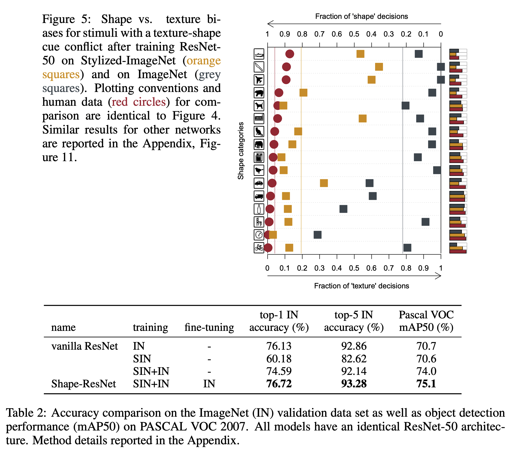

---

# Are Convolutional Neural Networks or Transformers more like human vision?

- How about ViT?

---

## Transformer / Attention-based Networks

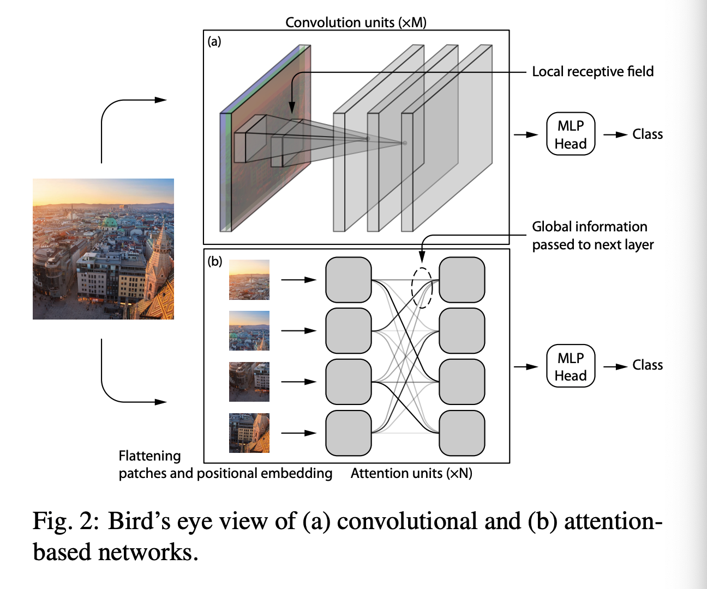

---

## Transformer / Shape vs. Texture

- Finetune with effective data augmentation

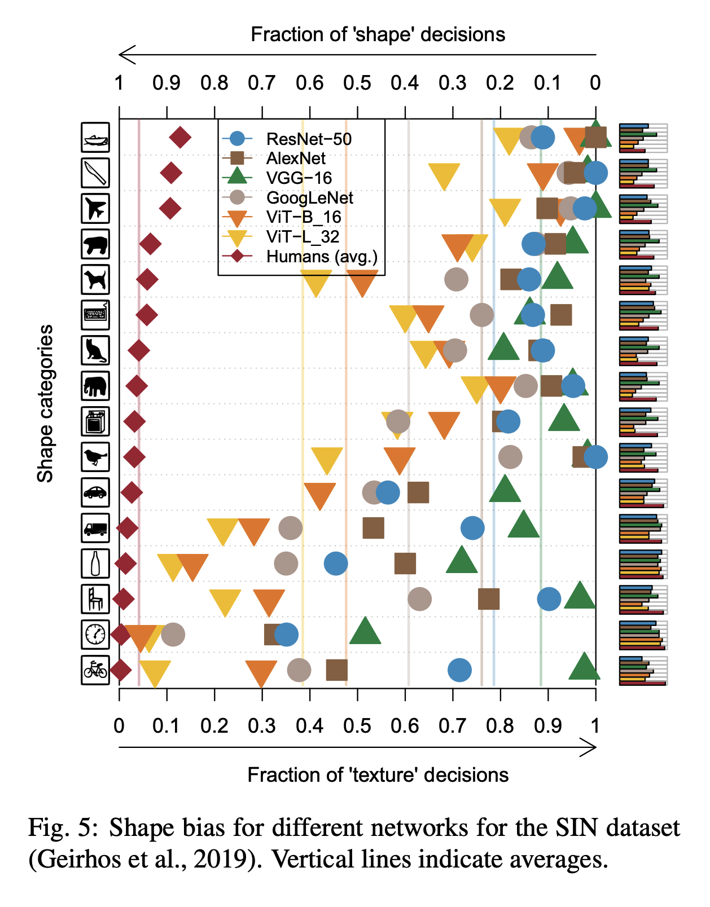 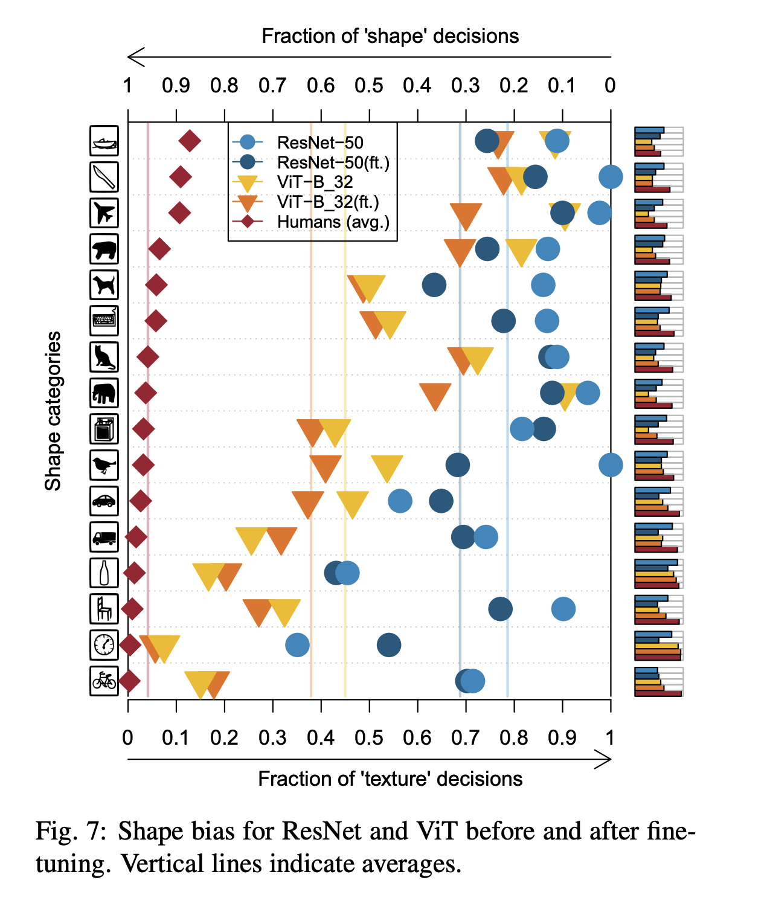

---

# Summary

- Research what you wanna know
- Sharp eyesight
- ?

---