<!-- _class: invert -->
# Image Inpainting Survey

Tomoki Tanimura (@tanimu)
d-hacks, Jin Nakazawa Lab, SFC, Keio University

---

<!-- _class: large -->
## What is Image Inpainting

- Image Inpainting is to fill missing parts of image.
- Important Point: Fill in the hole with 
  - visually reaslistic
  - semantically plausible

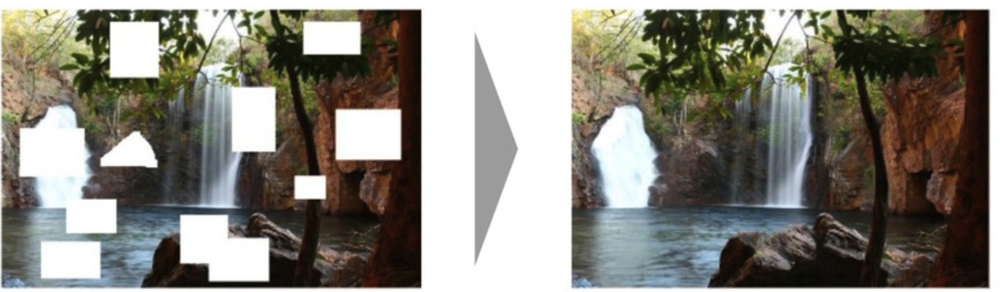

---

## Two main approach

- Patch Pasting
  - Search similar patches to hole-surrounding areas
  - PatchMatch, Scene Completion, etc.
- Learning based
  - Learn how to fill the hole using large scale dataset
  - GLCIC, Gated Conv, etc.

---

<!-- _class: invert -->
# Patch Pasting

2006 - 2008

- Search Similar Patch !

---

## Patch Pasting
### PatchMatch
1. Search Similar patch to the hole surrounding areas in an input image
2. Paste the searched patch to the hole
3. loop (1,2)

---

### PatchMatch
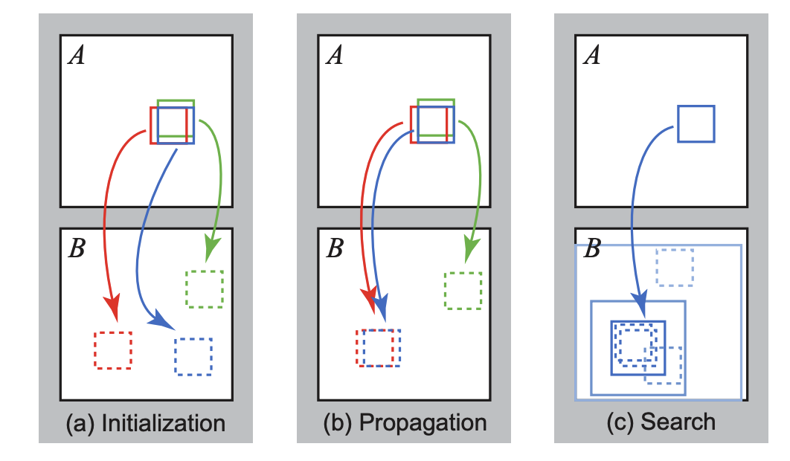

---

### PatchMatch
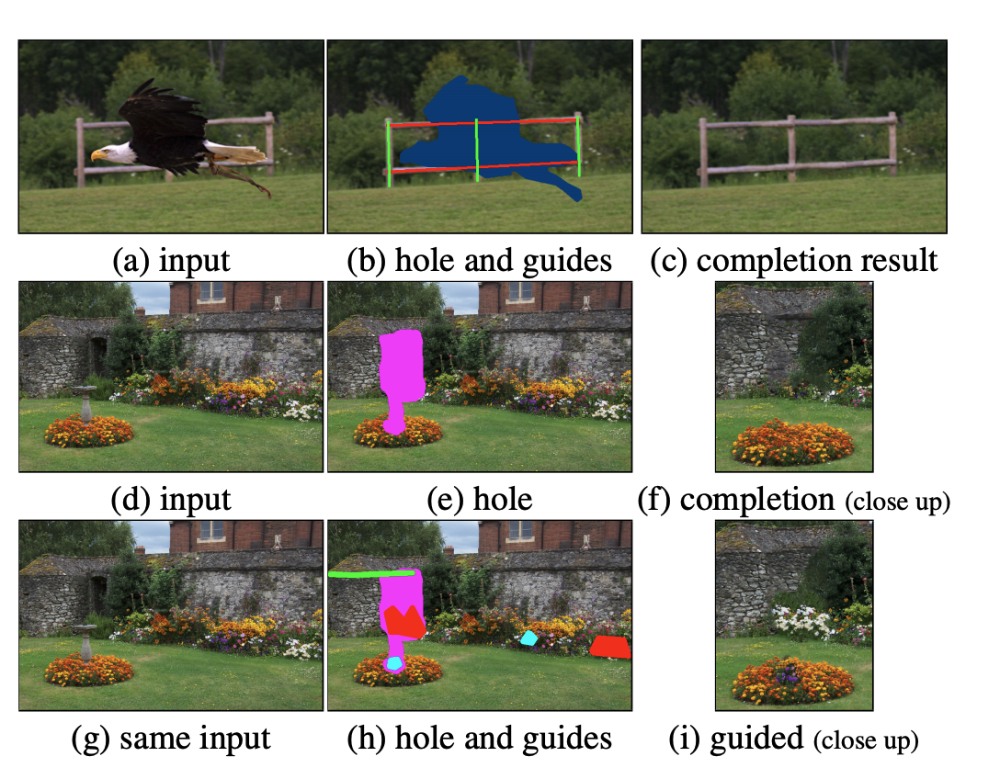

---

### PatchMatch
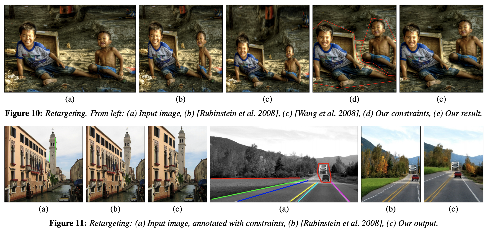

---

### Scene Completion
- Search the image similar to an input from large scale image database
- Search similar patch and paste it to the input's hole

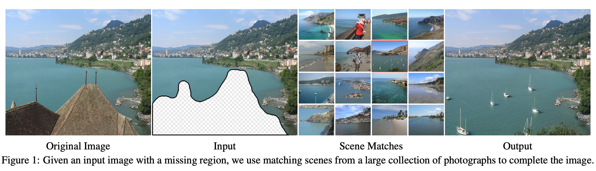

---

### Scene Completion

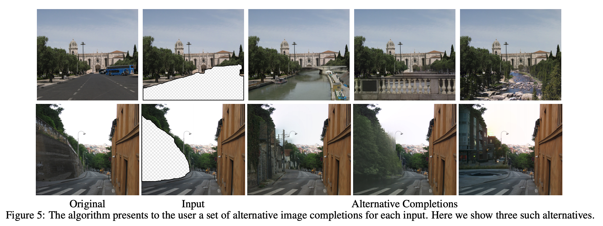

---

## Patch Pasting

- Good at filling in the small size hole and the hole in a stationary image (specific pattern image, scene image, etc.)
- Can't fill the hole with semantically prosible contents, Not good at filling the hole in a non-stationary image (city, face, etc.)

---

<!-- _class: invert -->
# Learning based

---

## Learning based

- Recent popular approach
- Generate the contents of the hole using Convolutional Neural Networks (CNN)
  - Input an image with hole to a model
  - Model predict a contents in the hole

---

## Evolution of Learning based ImIn

1. CNN Encoder-Decoder + Reconstruction Loss + Adversarial Loss
-> e.g. ContextEncoder, GLCIC
2. 1 + Additional Loss or Input
-> e.g. GICA, EdgeConnect, StructureImIn
3. (1 + 2 +) Masked Convolution
-> e.g. PartialConv, GatedConv

---

<!-- _class: invert -->
# 1. CNN Encoder-Decoder

2016 - 2017

- Initial Deep Learning based approach
- Use CNN and Adversarial Loss

---

### Context Encoder
Context Encoders: Learning Features by Inpainting

1. Input the image with hole to CNN
2. CNN encode the input to feature vector, then decode to the input while predicting the hole
3. Update model parameter to minimize the difference between the decoded image and the original input

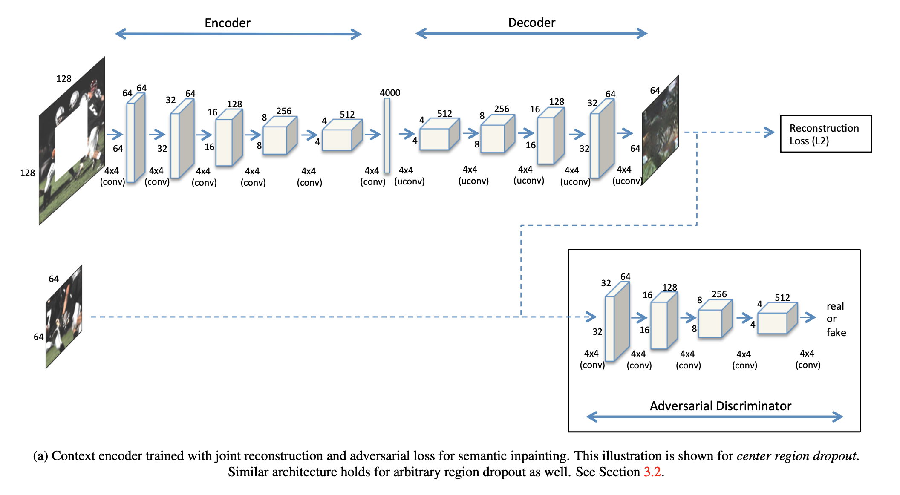

---

### Context Encoder

Generate the semantically prosible contents in the hole

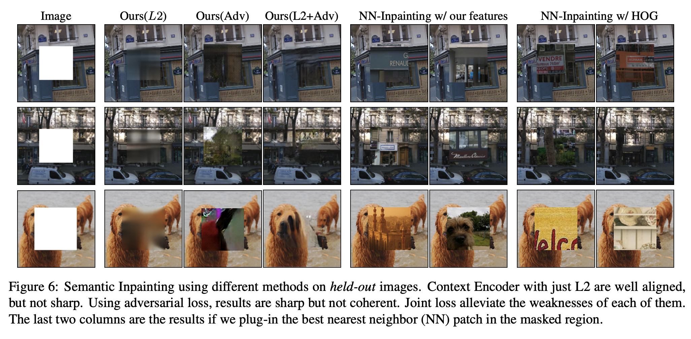

---

### Context Encoder

- Use ImIn as Representation Learning
- Use the encoder as feature extractor and test some vision tasks

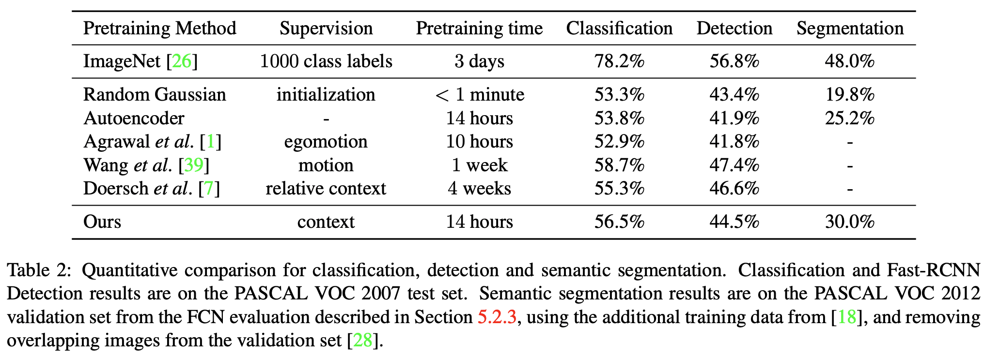

---

### GLCIC
Globally and Locally Image Completion

Difference from Context Encoder
- Add dilated convolution
- Evaluate generated image with globally and locally discriminator

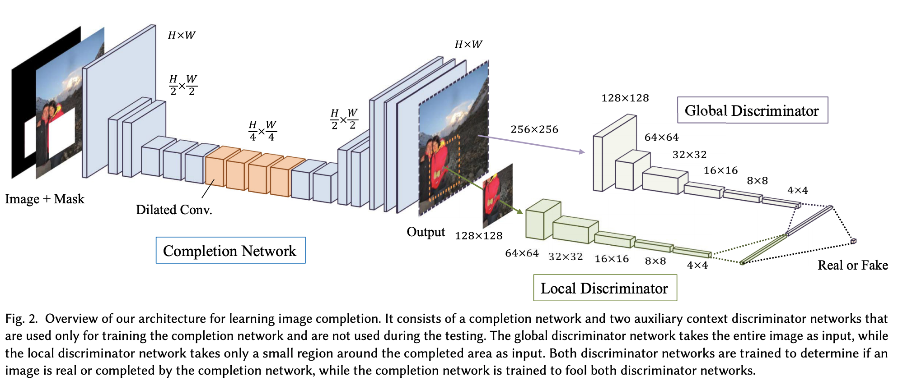

---

### GLCIC

- Fill the hole with semantically prosible and visually realistic contents
  - Effect of Globaly Discriminator
- Deal with high resolution image and non-stationary image

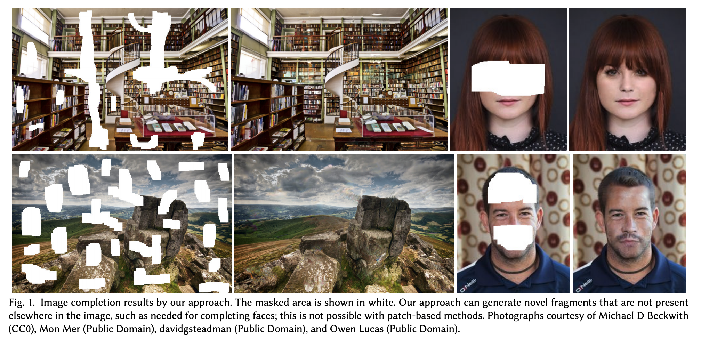

---

## CNN Encoder-Decoder

Advance
- CNN and Adversarail Loss enable to learn to generate the semantically prosible contents using large scale dataset

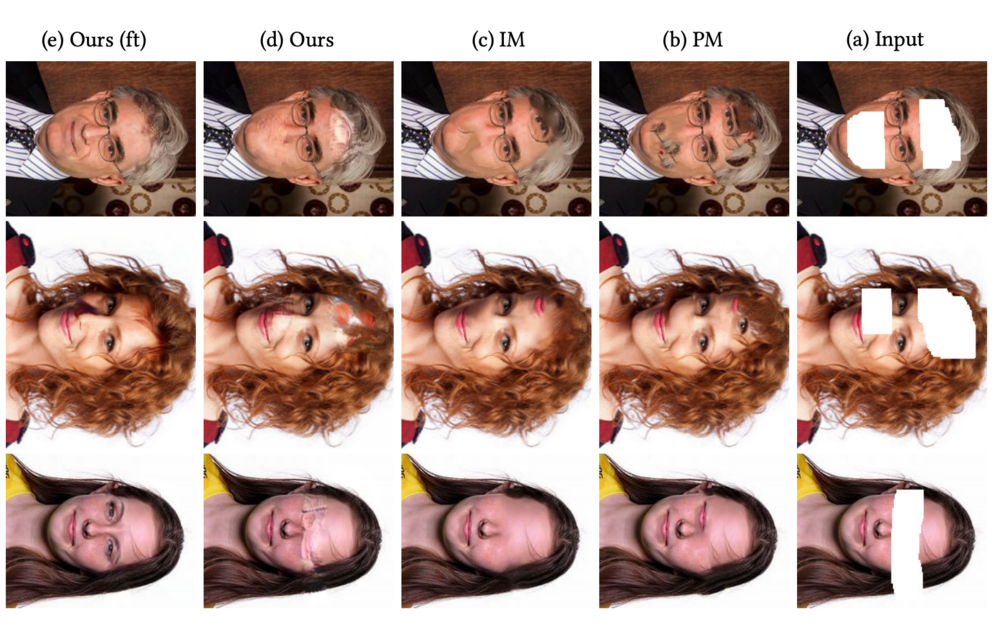

---

## CNN Encoder-Decoder

Drawback
- Context Encoder is not perfect
- GLCIC requires heavy post process (poisson blending)

---

<!-- _class: invert -->
# 2. Additional Loss and Input

2018 - 2019

- Use additional information and module to improve ImIn performance

---

### GICA
Generative Image Inpainting with Contextual Attention

- GLCIC + Coarse-to-Fine + Contextual Attention

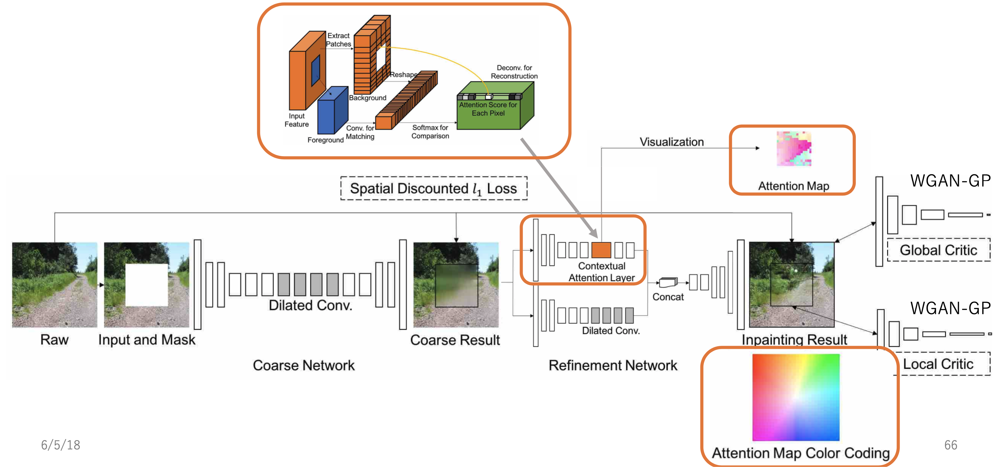

---

### GICA

- Is there difference from GLCIC ?

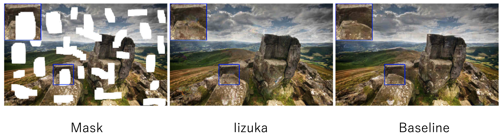

- Pay attention to image structure

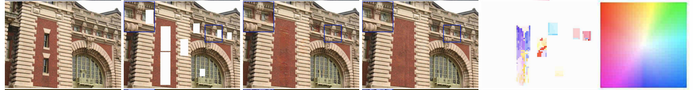

---

### EdgeConnect
EdgeConnect: Generative Image Inpainting with Adversarial Edge Learning

- Use edge information to support image inpainting model
  - Edge image with hole -> **Model** -> Completed edge image
  - Completed Edge image, Color image with hole -> **Model** -> Completed color image

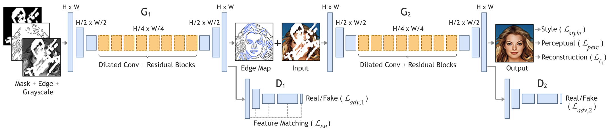

---

### EdgeConnect

- EdgeConnect is inspired by **"lines first, color next"**

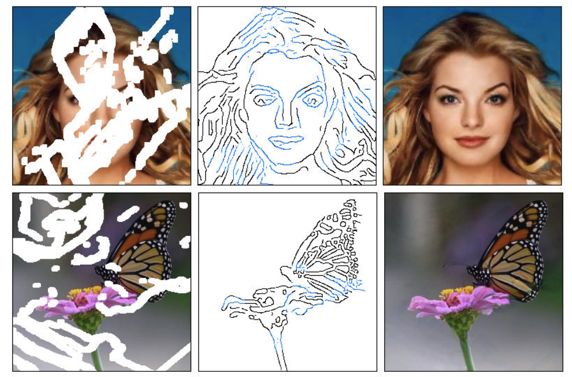

---

<!-- _class: invert -->
# 3. Masked Convolution

2018 - 2019

- Filter invalid pixel information to improve performance
- Get better performance with simple and reasonable extension

---

### Partial Convolution
Image inpainting for irregular holes using partial convolutions

- Use pixel information other than holes
- Introduce **Mask** to filter pixel information

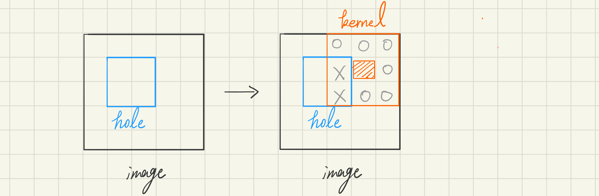
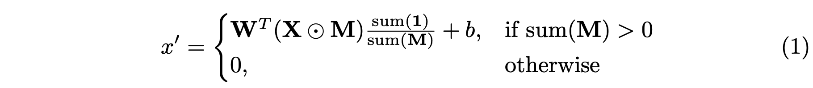

---

### Partial Convolution

- More effective to irregular holes because of not using hole area pixel information
- Achieve good performance with a simple U-Net architecture

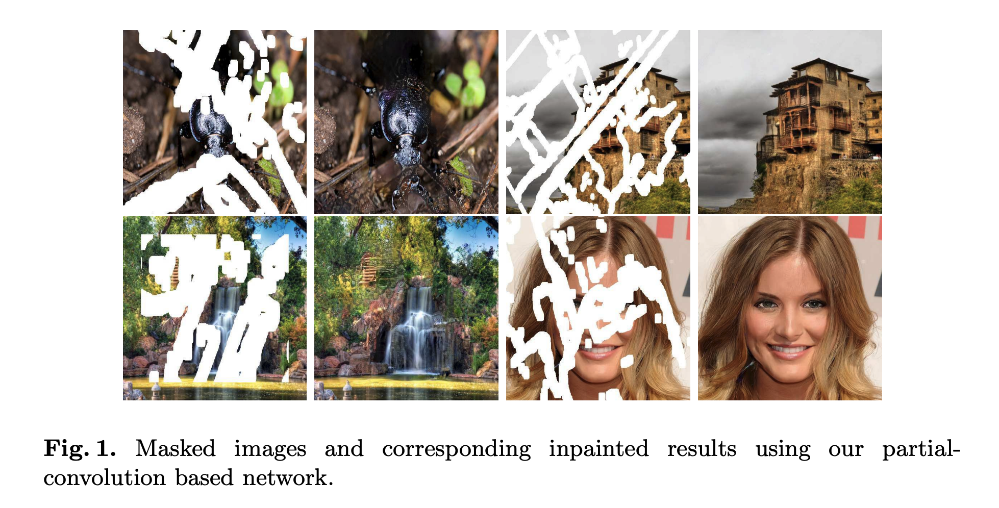

---

### Gated Convolution
Free-form image inpainting with gated convolution

---

<!-- _class: invert -->
## References
- [PatchMatch: a randomized correspondence algorithm for structural image editing](https://dl.acm.org/doi/10.1145/1531326.1531330)
- [Scene Completion Using Millions of Photographs](https://dl.acm.org/doi/abs/10.1145/1276377.1276382)
- [Context Encoders: Feature Learning by Inpainting](https://arxiv.org/abs/1604.07379)
- [Globally and locally consistent image completion](https://dl.acm.org/doi/abs/10.1145/3072959.3073659)
- [Generative Image Inpainting with Contextual Attention]()
- [EdgeConnect: Generative Image Inpainting with Adversarial Edge Learning](https://arxiv.org/abs/1901.00212)
- [Image Inpainting for Irregular Holes using Partial Convolution](http://openaccess.thecvf.com/content_ECCV_2018/html/Guilin_Liu_Image_Inpainting_for_ECCV_2018_paper.html)
- [Free-form Image Inpainting with Gated Convolution](http://openaccess.thecvf.com/content_ICCV_2019/html/Yu_Free-Form_Image_Inpainting_With_Gated_Convolution_ICCV_2019_paper.html)
