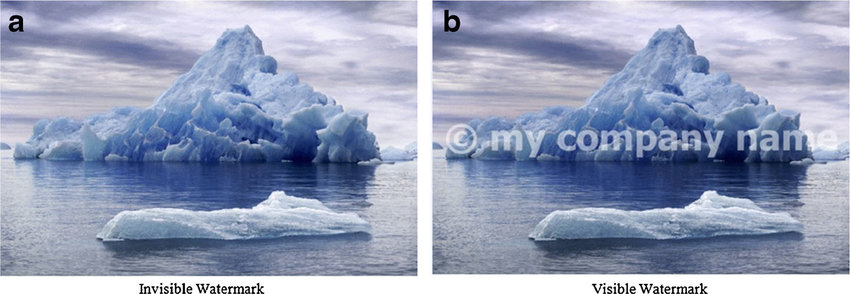
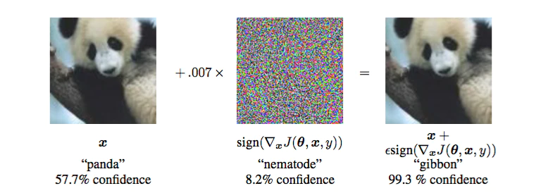

<!-- _class: invert -->
# Image Watermarking

Tomoki Tanimura (@tanimu)
d-hacks, Jin Nakazawa Lab, SFC, Keio University, M1

Created At: 2020/10/27

---

<!-- _class: invert -->
# What is Watermark?

Protect Copyrights!

---

<!-- _class: large -->
## What is Watermark

- Digital Watermark is the technology to leave the copyright information in an image itself

---

## Steganography VS Watermark

- Watermark
  - protect copyright of the image
  - publisher leave a message to an image to protect the rights
- Steganograpy
  - send secret message to reciever
  - sender and receiver want to communicate without leaking to adversary

---

## Visible and Invisible Watermark

- Visible
  - Ordinary Watermark which often used
  - Easy to put it
- **Invisible**
  - Human cannot recognize watermark
  - Put watermark in the imperceptible space to human

---

## Why Watermark with NN?

- NN is sensitive to tiny pertubation in image (GoodFellow, 2014)
  - This feature cause adversarial attack problem which cannot be solved yet
- We can use this sensitivity to hide and extract information in image

---

<!-- _class: invert -->
# Invisible Watermark

You cannot see it!

---

## Traditional Methods

---

## HiDDeN

---

## Recent1

---

## Recent2

---

<!-- _class: invert -->
# Visible Watermark Removal

Is it really effective?

---

## On the Effectiveness of Visible Watermarks

---

## Recent1

---

## Recent2

---

<!-- _class: invert -->
# Appendix: Model Watermarking

Protect copyrights of you model!

---

## Major1

---

## Recent1

---

## Summary

---

<!-- _class: invert -->
## References
- [Explaining and Harnessing Adversarial Examples](https://arxiv.org/abs/1412.6572)
- [HiDDeN: Hiding Data with Deep Networks](https://openaccess.thecvf.com/content_ECCV_2018/html/Jiren_Zhu_HiDDeN_Hiding_Data_ECCV_2018_paper.html)
- [On the Effectiveness of Visible Watermarks](https://openaccess.thecvf.com/content_cvpr_2017/html/Dekel_On_the_Effectiveness_CVPR_2017_paper.html)
