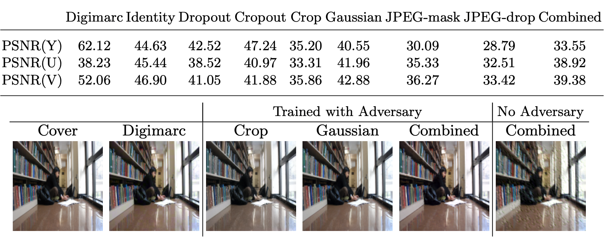

<!-- _class: invert -->
# Image Watermarking

Tomoki Tanimura (@tanimu)
d-hacks, Jin Nakazawa Lab, SFC, Keio University, M1

Created At: 2020/10/27

---

<!-- _class: invert -->
# What is Watermark?

Protect Copyrights!

---

<!-- _class: large -->
## What is Watermark

- Digital Watermark is the technology to leave the copyright information in an image itself

---

## Steganography VS Watermark

- Watermark
  - protect copyright of the image
  - publisher leave a message to an image to protect the rights
- Steganograpy
  - send secret message to reciever
  - sender and receiver want to communicate without leaking to adversary

---

## Visible and Invisible Watermark

- Visible
  - Ordinary Watermark which often used
  - Easy to put it
- **Invisible**
  - Human cannot recognize watermark
  - Put watermark in the imperceptible space to human

---

## Why Watermark with NN?

- NN is sensitive to tiny pertubation in image ([GoodFellow, 2014](https://arxiv.org/abs/1412.6572))
  - This feature cause adversarial attack problem which cannot be solved yet
- We can use this sensitivity to hide and extract information in image

---

<!-- _class: invert -->
# Invisible Watermark

You cannot see it!

---

## Traditional Methods

[Fourier Transformation](https://ja.wikipedia.org/wiki/%E3%83%95%E3%83%BC%E3%83%AA%E3%82%A8%E5%A4%89%E6%8F%9B)
- Robust to linear transformation ([Shelby, 2000](https://ieeexplore.ieee.org/document/846253))

[Wevelet Transformation](https://ja.wikipedia.org/wiki/%E3%82%A6%E3%82%A7%E3%83%BC%E3%83%96%E3%83%AC%E3%83%83%E3%83%88%E5%A4%89%E6%8F%9B)
- Two-band wavelet transform, embed the watermark bits on the wavelet coefficients ([Ning, 2007](https://ieeexplore.ieee.org/document/4271513))
- Multiband one, embedd it in the mean trend of some middle-frequency subimages ([Ming, 2001](https://ieeexplore.ieee.org/abstract/document/954550))

---

---

## [HiDDeN: Hiding Data with Deep Networks](https://openaccess.thecvf.com/content_ECCV_2018/html/Jiren_Zhu_HiDDeN_Hiding_Data_ECCV_2018_paper.html) 

- **More robust better image quality than traditionals**
- Model
  - **Encoder**: encode message to image
  - **Adversary**: Distort the encoded image
    - gaussian blur, dropout, crop, jpeg compression, ...
  - **Decoder**: Decode the encoded message from the image

---

### Adversary (Noise)

---

### Loss Function

- 3 Loss fucntions
  - Image Reconstruction Loss
    - Difference between cover and encoded image
  - Message Reconstruction Loss
    - Difference between original and decoded message
  - Adversarial Loss
    - Adversarial Loss for cover and encoded image

---

### Metrics

- Capacity
  - Bits per Pixel (`= L / HWC`)
- Secrecy
  - PSNR (larger is higher quality)
  - Detection Rate (for steganography)
- Robustness
  - Bit Accuracy of Message

Important metics for steganography and watermark are different 
Robustness is most important for watermark

---

### Experiment / Secrecy

- Quality is not bad

---

### Experiment / Robustness

- JPEG is hardest distortion
- Specialized trained model is robust except for JPEG
- Non-adversary trained model cannot deal with Crop

---

## [Distortion Agnostic Deep Watermarking](https://openaccess.thecvf.com/content_CVPR_2020/html/Luo_Distortion_Agnostic_Deep_Watermarking_CVPR_2020_paper.html)

CVPR2020

- "Attack Network" distort the encoded image with NN
  - Not define the specific distortion type
- "Channel Encoding" treat the message as the feature vector in the model

---

---

### Result

---

- As robust as the specialized and combined of HiDDeN

---

## [StegaStamp: Invisible Hyperlinks in Physical Photographs](https://openaccess.thecvf.com/content_CVPR_2020/html/Tancik_StegaStamp_Invisible_Hyperlinks_in_Physical_Photographs_CVPR_2020_paper.html)

CVPR2020

- Realize the tracebility of realworld phisycal images
- e.g. Embed URL to realworld images, and it can be scanned by AR glass

---

### Encoded images

---

### Realworld Experiment

---

### Decoding Accuracy

---

### Encoded images for different message length

- To embed longer message, some square artifacts appear

---

<!-- _class: invert -->
# Visible Watermark Removal

Is it really effective?

---

## [On the Effectiveness of Visible Watermarks](https://openaccess.thecvf.com/content_cvpr_2017/html/Dekel_On_the_Effectiveness_CVPR_2017_paper.html)

- Easy to remove visible watermark by exploiting collection of watermarked images
- This is image collection approach, it's new

---

### Comparison to baseline

- Our result is best quality

---

### Analysis for inconsistency watermark pattern

- Not robust to spatial perturbation
- Do perturbation affect to reconstruction phase?

---

### Result for stock imagery

---

## [Blind Visual Motif Removal from a Single Image](https://openaccess.thecvf.com/content_CVPR_2019/html/Hertz_Blind_Visual_Motif_Removal_From_a_Single_Image_CVPR_2019_paper.html)

- Remove visual motif (such as watermark) from image by using only single image
- Easy to remove
- This is blind removal

---

### Method

- Extract background, motif area, foreground (motif) from the image, and then reconstruct the original image

---

### Result images

---

<!-- _class: invert -->
# Appendix: Model Watermarking

Protect copyrights of you model!

Coming soon!

---

## Summary

### Invisible Watermark with NN

- Under development
- Encoder / Adversary / Decoder framework is the best
- Robustness is most important

### Visible Watermark Removal

- Single Image VS Multiple Image (Blind VS Non-Blind)
- Strong watermark which cannot be removed is needed

